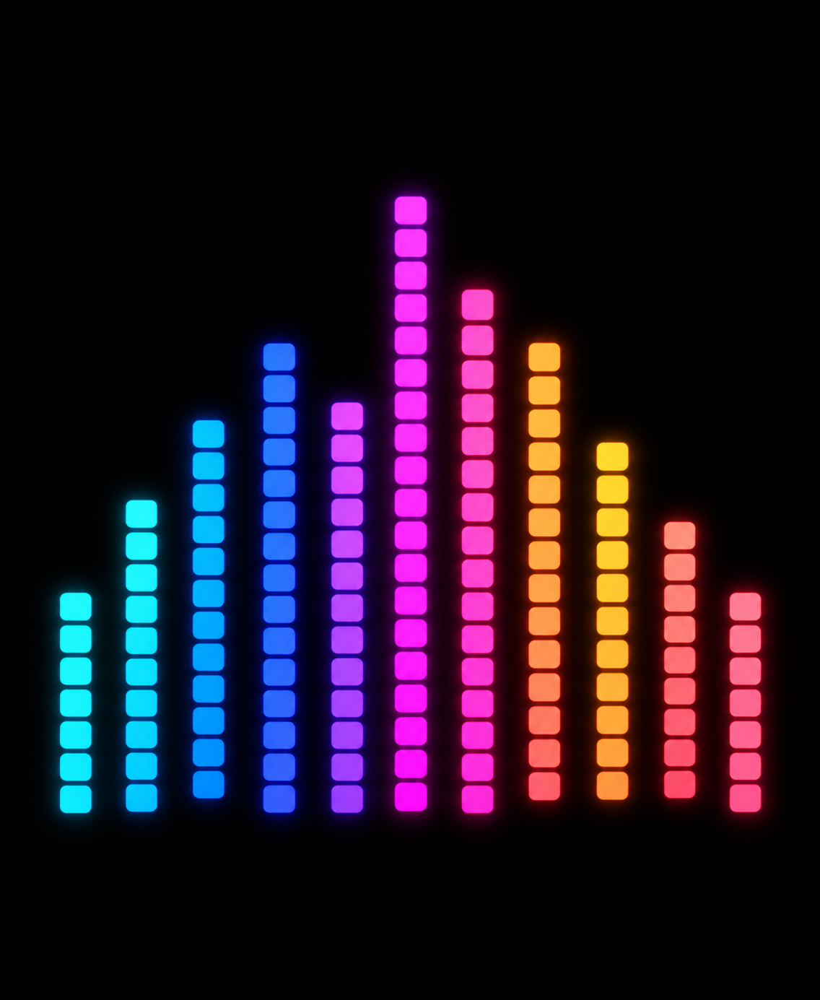
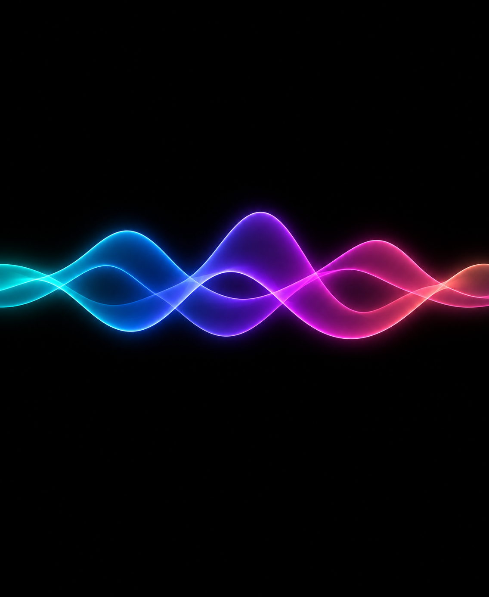
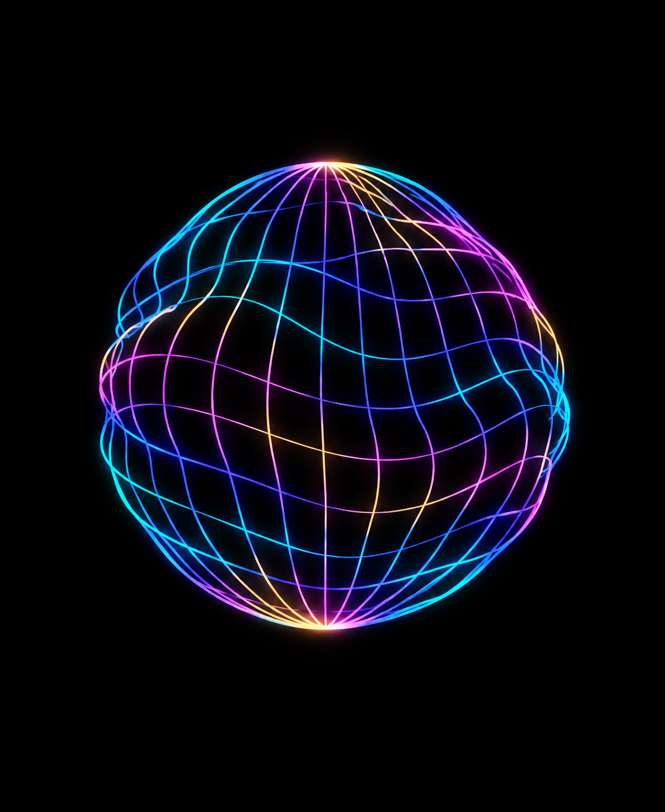
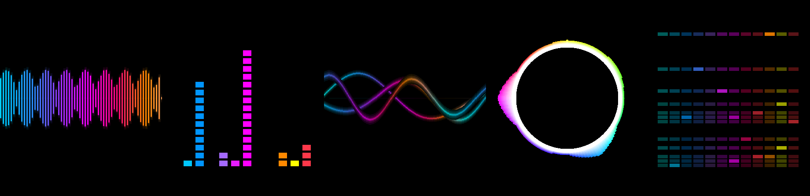

# Visualizer concepts

These images were generated with imagegen as design references. The firmware does not store or display the PNGs; it draws the five live modes in RGB565. `rendered-preview.png` was generated from the actual C renderer using synthetic microphone samples at the board's 368 × 448 resolution. It is a software preview, not a photo of the board. The orbit mesh concept was explored but replaced by a simpler frequency-reactive circle after on-device testing.

The three generated concept prompts were:

## Spectrum

> Use case: stylized-concept. Asset type: design concept for a 368×448 portrait AMOLED screen on a tiny ESP32 microphone. Primary request: invent a vivid live audio spectrum display inspired by colorful pixel equalizers, but original in its arrangement. Pure black OLED background; a compact set of tall vertical rounded color bars built from luminous square cells, climbing and falling at different heights. Hue moves from electric cyan and blue through violet, hot pink, amber and coral. Composition centered with generous black margins, legible at 1.8 inches. Crisp geometric shapes that a microcontroller could draw procedurally, not a photograph of the device. No text, labels, border, controls, device bezel, or watermark.

## Aurora ribbon

> Use case: stylized-concept. Asset type: design concept for a 368×448 portrait AMOLED screen on a tiny ESP32 microphone. Primary request: invent a second live audio visualizer called Aurora Ribbon, inspired by translucent luminous sound waves. Deep OLED black background. Across the middle, three smooth overlapping horizontal sine-like ribbons with thin neon outlines, varying height with voice. Colors transition cyan to blue to violet to magenta to coral; subtle layered glow, but remain simple enough to approximate with lines and gradients in microcontroller code. Centered composition and large black negative space above and below; clear at 1.8 inches. Not a photograph of hardware. No text, controls, border, icons, or watermark.

## Orbit mesh

> Use case: stylized-concept. Asset type: design concept for a 368×448 portrait AMOLED screen on a tiny ESP32 microphone. Primary request: invent a third live audio visualizer called Orbit Mesh, inspired by a dancing wireframe sound sculpture. On a pure OLED black portrait canvas, centered in the screen, a single luminous orb made of a manageable number of thin curved latitude and longitude lines, subtly warped by sound, with cyan, cobalt, violet, magenta, and warm gold strokes. It should feel dimensional and playful yet be drawable as procedural line segments on an embedded display. Generous black margins, strong silhouette at 1.8 inches, no photographic device or room. No text, icons, controls, border, or watermark.

## Firmware renderer preview

Left to right: scrolling colored waveform, fading spectrum, shaded aurora ribbon, white-rimmed frequency circle, and spectral waterfall. Each panel is one native-size frame.

